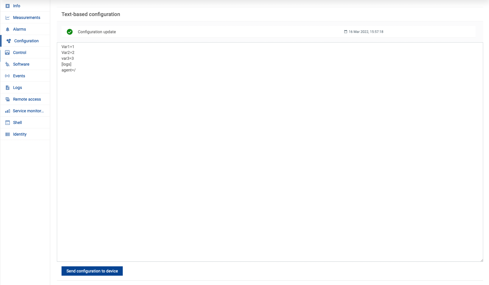

# c8y-textconfig-plugin

## Plugin summary

thin-edge.io [text-based configuration operation](https://cumulocity.com/guides/reference/smartrest-two/#configuration-513) plugin for Cumulocity IoT.

:warning: The plugin itself currently only receives and acknowledges the config change, but does not do anything with it. The part where this can be included is shown in the code section.



**Technical summary**

The following details the technical aspects of the plugin to get an idea what systems it supports.

|||
|--|--|
|**Languages**|`python3`|
|**CPU Architectures**|`all/noarch`. Not CPU specific|
|**Supported init systems**|`N/A`|
|**Required Dependencies**|`python3`|
|**Optional Dependencies (feature specific)**|-|

### How to do I get it?

The following linux package formats are provided on the releases page and also in the [tedge-community](https://cloudsmith.io/~thinedge/repos/community/packages/) repository:

|Operating System|Repository link|
|--|--|
|Debian/Ubuntu|[](https://cloudsmith.io/~thinedge/repos/community/packages/detail/deb/c8y-textconfig-plugin/latest/a=all;d=any-distro%252Fany-version;t=binary/)|
|RHEL/CentOS/Fedora/openSUSE|[](https://cloudsmith.io/~thinedge/repos/community/packages/detail/rpm/c8y-textconfig-plugin/latest/a=noarch;d=any-distro%252Fany-version;t=binary/)|
|Alpine Linux|[](https://cloudsmith.io/~thinedge/repos/community/packages/detail/alpine/c8y-textconfig-plugin/latest/a=noarch;d=alpine%252Fany-version/)|


### What will be deployed to the device?

* The following operation plugins are installed:
    * `c8y/c8y_Configuration` - to apply text based configuration from Cumulocity

## Plugin Dependencies

The following packages are required to use the plugin:

* python3

## Development

The following tools are requires for local development. Please install them before following the instructions:

* [nfpm](https://nfpm.goreleaser.com/tips/) - Tool to build linux packages
* [go-c8y-cli](https://goc8ycli.netlify.app/) - A Cumulocity IoT CLI app
* [c8y-tedge extension](https://github.com/thin-edge/c8y-tedge) - go-c8y-cli extension for thin-edge.io to help with bootstrapping

### Start demo

1. Build the c8y-textconfig-plugin package

    ```sh
    just build
    ```

2. Start the demo

    ```sh
    just up
    ```

3. Activate your Cumulocity IoT session in go-c8y-cli where you want to bootstrap the device to

    ```sh
    set-session
    ```

    `set-session` is part of [go-c8y-cli](https://goc8ycli.netlify.app/), check out the documentation for instructions on how to install and create your session if you don't already have one.

4. Bootstrap the device

    ```sh
    just bootstrap
    ```

    The bootstrap command used the [c8y-tedge extension](https://github.com/thin-edge/c8y-tedge).

### Stop demo

```sh
just down
```
